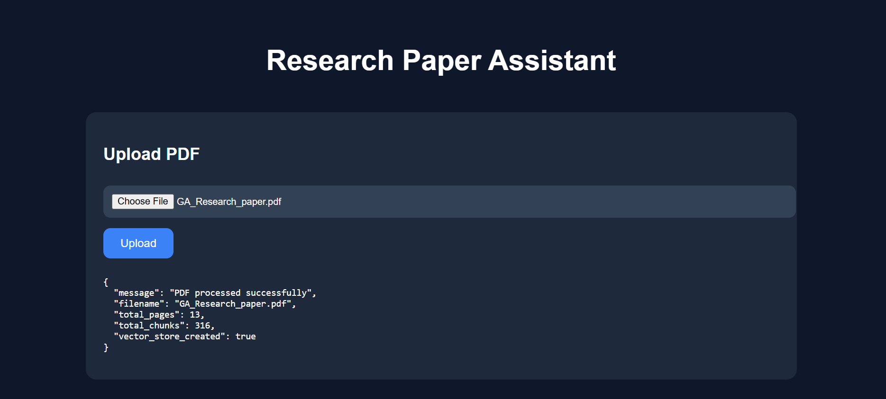
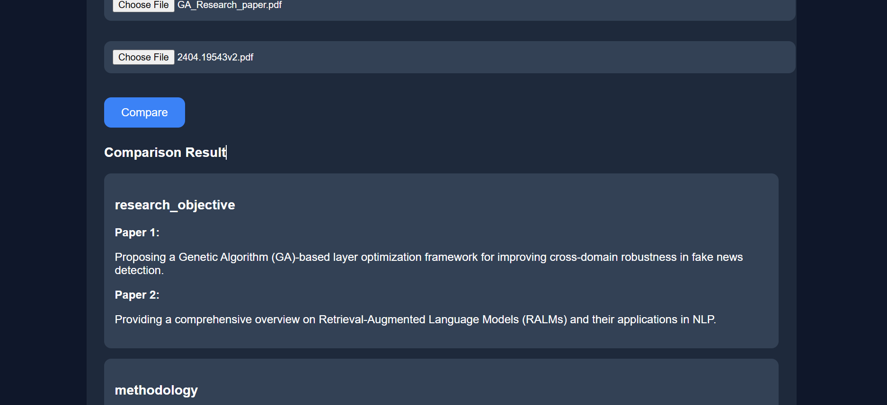

# Research Paper Assistant

An AI-powered Research Paper Assistant built using Retrieval-Augmented Generation (RAG) that enables users to upload research papers, ask contextual questions, retrieve grounded answers with citations, and compare multiple research papers intelligently.

---

# Features

- Upload research papers in PDF format
- Ask contextual questions from uploaded papers
- Retrieval-Augmented Question Answering (RAG)
- Source citations with page references
- Semantic + score-based chunk retrieval
- Research paper comparison
- Structured JSON comparison outputs

---

# Tech Stack

## Backend
- Python
- FastAPI
- LangChain
- FAISS Vector Database
- HuggingFace Embeddings (`BAAI/bge-small-en-v1.5`)
- Groq LLM API (`llama-3.1-8b-instant`)

## Frontend
- HTML
- CSS
- JavaScript

---

# System Workflow

```text
PDF Upload
    ↓
Text Extraction
    ↓
Chunking
    ↓
Embedding Generation
    ↓
FAISS Vector Store
    ↓
Semantic Retrieval
    ↓
Top-K Score-Based Retrieval
    ↓
LLM Context Injection
    ↓
Answer Generation
```

---

# Retrieval Mechanism

The system uses a hybrid semantic retrieval pipeline.

## Semantic Search

Research paper chunks are converted into dense vector embeddings using:

```text
BAAI/bge-small-en-v1.5
```

These embeddings are stored inside a FAISS vector database for efficient similarity search.

---

## Score-Based Retrieval

During querying:

- User question is embedded
- Similar chunks are retrieved using vector similarity
- Retrieval scores are used to rank chunks
- Top relevant chunks are injected into the LLM context

This improves:

- Context grounding
- Answer precision
- Citation relevance
- Hallucination reduction

---

# Key Functionalities

## 1. Research Paper Question Answering

The system retrieves relevant paper chunks and generates grounded responses.

---

## 2. Source Citations

Each generated answer includes:

- Page references
- Retrieved contextual chunks
- Collapsible citation cards

---

## 3. Research Paper Comparison

The application compares two research papers based on:

- Research Objective
- Methodology
- Contributions
- Limitations

The comparison is generated using extracted Abstract and Conclusion sections from both papers.

---

# Frontend Features

- Interactive cards
- Collapsible citations
- Structured comparison rendering
- Responsive layout

---

# Installation

## 1. Clone Repository

```bash
git clone https://github.com/IshitaSharma0/research-paper-assistant.git
```

---

## 2. Install Dependencies

```bash
pip install -r requirements.txt
```

---

# Project Structure

```text
research_rag_assistant/
│
├── frontend/
│   ├── index.html
│   ├── style.css
│   └── script.js
│
├── data/
│
├── main.py
├── requirements.txt
├── .gitignore
└── README.md
```

---


# UI Highlights

- Dark themed interface
- Responsive design
- Interactive retrieval display
- Citation expansion support
- Structured comparison cards

---

# Screenshots

## Home Interface



---

## Question Answering


---

## Research Paper Comparison



---

